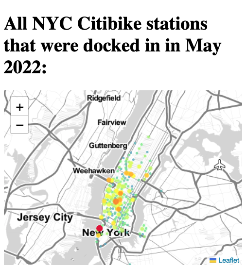

# The Breathing City (working title): An app to explore NYC's transit data.

#### Inspired by "The City is Alive" by Justin Fung: https://github.com/citrusvanilla/manhattanpopulationexplorer . While that project was already great, it was made pre-Covid. This new project will set out to provide a comparison between pre-and-post-Covid NYC, by its travel patterns.

&nbsp;
## Current progress

#### Some data viz, to start off. NYC bikeshare data for the month of April 2020 was provided publicly by Citibike. This dataset holds about 700,000 rows, each one representing a bike-ride in that month. Some SQL was used to boil this dataset down to: One row per bike station, along with a number indicating how many times it was used.

&nbsp;
#### A web app is in-progress to provide an interactive map. Pictured below is said map visualizing the data mentioned above, where the brighter dots indicate more usage:

&nbsp;
